### So sánh các thuật toán sắp xếp

| Thuật toán               | Độ phức tạp tốt nhất | Độ phức tạp tệ nhất | Độ phức tạp trung bình | Độ phức tạp không gian | Ổn định | Nội tại |
|--------------------------|----------------------|---------------------|------------------------|------------------------|---------|---------|
| Selection Sort           | O(n^2)               | O(n^2)              | O(n^2)                 | O(1)                   | Không   | Có      |
| Insertion Sort           | O(n)                 | O(n^2)              | O(n^2)                 | O(1)                   | Có      | Có      |
| Interchange Sort         | O(n^2)               | O(n^2)              | O(n^2)                 | O(1)                   | Không   | Có      |
| Bubble Sort              | O(n)                 | O(n^2)              | O(n^2)                 | O(1)                   | Có      | Có      |
| Shaker Sort              | O(n)                 | O(n^2)              | O(n^2)                 | O(1)                   | Có      | Có      |
| Binary Insertion Sort    | O(n)                 | O(n^2)              | O(n^2)                 | O(1)                   | Có      | Có      |
| Shell Sort               | O(n log n)           | O(n^(3/2))          | O(n log n)             | O(1)                   | Không   | Có      |
| Heap Sort                | O(n log n)           | O(n log n)          | O(n log n)             | O(1)                   | Không   | Có      |
| Quick Sort               | O(n log n)           | O(n^2)              | O(n log n)             | O(log n)               | Không   | Có      |
| Merge Sort               | O(n log n)           | O(n log n)          | O(n log n)             | O(n)                   | Có      | Không   |
| Radix Sort               | O(nk)                | O(nk)               | O(nk)                  | O(n + k)               | Có      | Có      |

### So sánh ưu điểm và khuyết điểm của các thuật toán

#### Selection Sort
- **Ưu điểm:** Dễ cài đặt và hiểu.
- **Khuyết điểm:** Không hiệu quả với danh sách lớn, độ phức tạp thời gian luôn là O(n^2).

```cpp
void SelectionSort(int a[],int n )
{
	int min; // chỉ số phần tử nhỏ nhất trong dãy hiện hành
	for (int  i=0; i<n-1 ; i++)
	{  
		min = i; 
		for(int j = i+1; j < n ; j++)
	   	  if (a[j] < a[min])
		   min = j; // ghi nhận vị trí phần tử nhỏ nhất
		if (min != i)
	   	   swap(a[min], a[i]);
	}
}
```
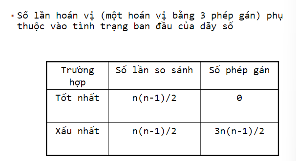

#### Insertion Sort
- **Ưu điểm:** Hiệu quả với danh sách nhỏ hoặc gần như đã sắp xếp, ổn định.
- **Khuyết điểm:** Độ phức tạp thời gian tệ nhất là O(n^2).

```cpp
void InsertionSort(int a[], int n )
{	
    int pos, x;
	for(int i=1 ; i<n ; i++) //đoạn a[0] đã sắp
	{	x = a[i];pos=	i-1;
		while(pos>=0 && a[pos]>x)
		{	a[pos+1] = a[pos];
			pos--;
		}
		a[pos+1]=x;
	}
}
```
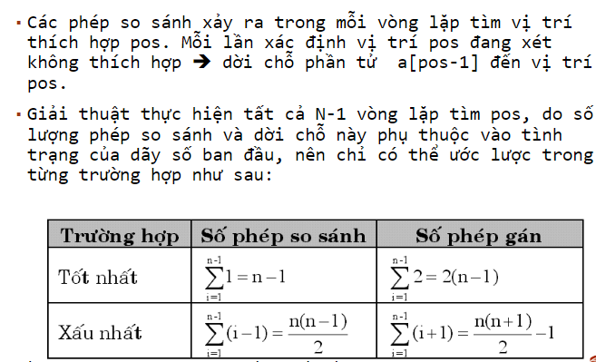


#### Interchange Sort
- **Ưu điểm:** Dễ hiểu và cài đặt.
- **Khuyết điểm:** Không hiệu quả với danh sách lớn, không ổn định, độ phức tạp thời gian là O(n^2).

```cpp
void InterchangeSort(int a[], int n)
{	
	int  i, j;
	for (i = 0 ; i<n-1 ; i++)
		for (j =i+1; j < n ; j++)
		   if(a[j]< a[i]) //nếu có nghịch thế thì đổi chỗ
			swap(a[i],a[j]);
}
```
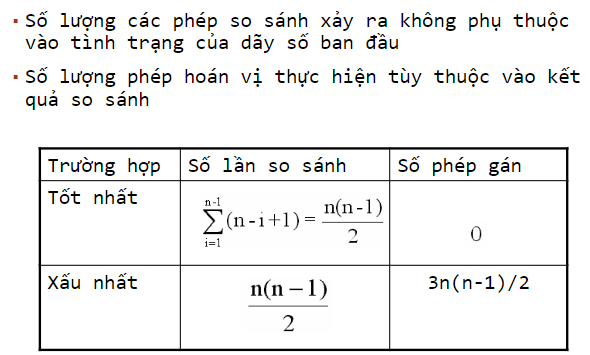

#### Bubble Sort
- **Ưu điểm:** Dễ hiểu và cài đặt, ổn định.
- **Khuyết điểm:** Không hiệu quả với danh sách lớn, độ phức tạp thời gian là O(n^2).

```cpp
void BubbleSort(int a[], int n)
{	
	int i, j;
	for (i = 0 ; i<n-1 ; i++) {
		for (j =n-1; j>i ; j --) {
		    if(a[j]< a[j-1])	{
                swap(a[j], a[j-1]);
            }
        }
    }
}
```
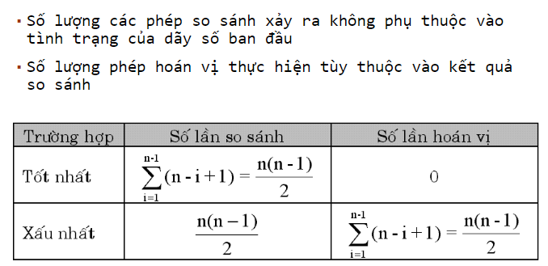

#### Shaker Sort
- **Ưu điểm:** Cải thiện so với Bubble Sort khi có thể phát hiện sắp xếp trong mỗi lần lặp từ hai phía.
- **Khuyết điểm:** Độ phức tạp thời gian là O(n^2).
```cpp
void ShakerSort(int a[], int n) {
    int left = 0;
    int right = n - 1;
    int k = 0;
    while (left < right) {
        for (int i = left; i < right; i++) {
            if (a[i] > a[i + 1]) {
                swap(a[i], a[i + 1]);
                k = i;
            }
        }
        right = k;
        for (int i = right; i > left; i--) {
            if (a[i] < a[i - 1]) {
                swap(a[i], a[i - 1]);
                k = i;
            }
        }
        left = k;
    }
}
```
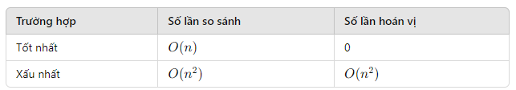

#### Binary Insertion Sort
- **Ưu điểm:** Tìm kiếm nhị phân để chèn làm giảm số lần so sánh.
- **Khuyết điểm:** Không giảm số lần di chuyển phần tử, độ phức tạp thời gian là O(n^2).

```cpp
void BinaryInsertionSort(int a[], int n) {
    for (int i = 1; i < n; i++) {
        int x = a[i];
        int left = 0;
        int right = i - 1;
        while (left <= right) {
            int mid = (left + right) / 2;
            if (x < a[mid]) {
                right = mid - 1;
            } else {
                left = mid + 1;
            }
        }
        for (int j = i - 1; j >= left; j--) {
            a[j + 1] = a[j];
        }
        a[left] = x;
    }
}
```
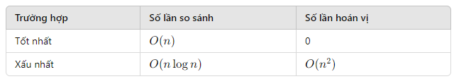

#### Shell Sort
- **Ưu điểm:** Hiệu quả với danh sách lớn hơn so với Insertion Sort, cải thiện độ phức tạp thời gian.
- **Khuyết điểm:** Không ổn định, phức tạp trong việc lựa chọn khoảng cách nhảy.

```cpp
void ShellSort(int a[], int n) {
    for (int gap = n / 2; gap > 0; gap /= 2) {
        for (int i = gap; i < n; i++) {
            int temp = a[i];
            int j;
            for (j = i; j >= gap && a[j - gap] > temp; j -= gap) {
                a[j] = a[j - gap];
            }
            a[j] = temp;
        }
    }
}
```

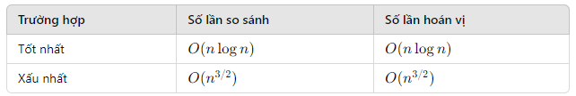

#### Heap Sort
- **Ưu điểm:** Độ phức tạp thời gian là O(nlogn), không bị ảnh hưởng bởi dữ liệu đầu vào.
- **Khuyết điểm:** Không ổn định, phức tạp hơn so với các thuật toán sắp xếp khác.

```cpp
void Heapify(int a[], int n, int i) {
    int largest = i;
    int left = 2 * i + 1;
    int right = 2 * i + 2;

    if (left < n && a[left] > a[largest]) {
        largest = left;
    }

    if (right < n && a[right] > a[largest]) {
        largest = right;
    }

    if (largest != i) {
        swap(a[i], a[largest]);
        Heapify(a, n, largest);
    }
}

void HeapSort(int a[], int n) {
    for (int i = n / 2 - 1; i >= 0; i--) {
        Heapify(a, n, i);
    }

    for (int i = n - 1; i > 0; i--) {
        swap(a[0], a[i]);
        Heapify(a, i, 0);
    }
}
```

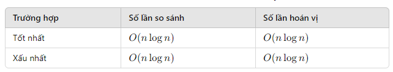

#### Quick Sort
- **Ưu điểm:** Rất nhanh với độ phức tạp trung bình là O(nlogn), phổ biến.
- **Khuyết điểm:** Không ổn định, độ phức tạp tệ nhất là O(n^2).

```cpp
void QuickSort(int a[], int left, int right)
{ 	
	int i, j, x;
	if (left < right)	return;
  	x = a[(left+right)/2]; // chọn phần tử giữa làm giá trị mốc
  	i = left; j = right;
  	do{
     	 while(a[i] < x) i++;
     	 while(a[j] > x) j--;
     	 if(i <= j) { 
		  Swap(a[i], a[j]);
       	  i++ ; j--;
	 	 }
	       } while(i < j) ;
	   if(left<j) QuickSort(a, left, j);
	   if(i<right) QuickSort(a, i, right);
}
```
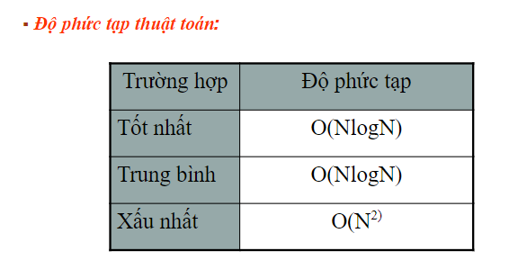

#### Merge Sort
- **Ưu điểm:** Ổn định, độ phức tạp thời gian là O(n log n), hiệu quả với dữ liệu lớn.
- **Khuyết điểm:** Không nội tại, cần không gian thêm O(n).

```cpp
void MergeSort(int a[], int n) {
   int b[MAX];
   int c[MAX];
   int p, pb, pc; //các chỉ số trên các mảng a, b, c
   int i, k = 1;  //độ dài của dãy con khi phân hoạch
   do {
     Distribute(a, n, pb, pc, k, b, c);
     Merge(a, pb, pc, k, b, c);
     k *= 2;
   } while (k < n);
}

void Distribute(int a[], int n, int &pb, int &pc, 
                int k, int b[], int c[]) {
  int i, p;
  // tách a thành b và c
  p = pb = pc = 0;
  while (p < n) {
    for (i = 0; (p < n) && (i < k); i++)
       b[pb++] = a[p++];
    for (i = 0; (p < n) && (i < k); i++)
       c[pc++] = a[p++];
  }
}

void Merge(int a[], int nb, int nc, int k, int b[], int c[]) {
  int p, pb, pc, ib, ic, kb, kc;
  p = pb = pc = 0;
  ib = ic = 0;
  while ((0 < nb) && (0 < nc)) {
     kb = min(k, nb); kc = min(k, nc);
     if (b[pb + ib] <= c[pc + ic]) {
        a[p++] = b[pb + ib];
        ib++;
        if (ib == kb) {
           for (; ic < kc; ic++)
               a[p++] = c[pc + ic];
           pb += kb; pc += kc;
           ib = ic = 0;
           nb -= kb; nc -= kc;
        }
     }
    else {
        a[p++] = c[pc + ic];
        ic++;
        if (ic == kc) {
           for (; ib < kb; ib++)
              a[p++] = b[pb + ib];
           pb += kb; pc += kc;
           ib = ic = 0;
           nb -= kb; nc -= kc;
        }
    }
  }
}
```

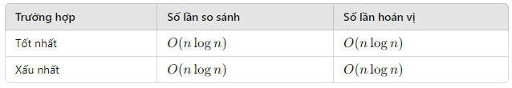

#### Radix Sort
- **Ưu điểm:** Rất nhanh với độ phức tạp thời gian O(nk), ổn định.
- **Khuyết điểm:** Chỉ áp dụng cho các số nguyên, cần không gian thêm O(n + k).

```cpp
// Hàm lấy giá trị lớn nhất trong mảng
int getMax(int a[], int n) {
    int max = a[0];
    for (int i = 1; i < n; i++)
        if (a[i] > max)
            max = a[i];
    return max;
}

// Hàm đếm số lượng chữ số và phân loại các phần tử
void countSort(int a[], int n, int exp) {
    int output[n];
    int i, count[10] = {0};

    // Đếm số lần xuất hiện của mỗi chữ số
    for (i = 0; i < n; i++)
        count[(a[i] / exp) % 10]++;

    // Thay đổi count[i] sao cho count[i] chứa vị trí của chữ số trong output[]
    for (i = 1; i < 10; i++)
        count[i] += count[i - 1];

    // Xây dựng output[]
    for (i = n - 1; i >= 0; i--) {
        output[count[(a[i] / exp) % 10] - 1] = a[i];
        count[(a[i] / exp) % 10]--;
    }

    // Sao chép output[] vào a[], để a[] chứa các số đã sắp xếp theo chữ số hiện tại
    for (i = 0; i < n; i++)
        a[i] = output[i];
}

// Hàm chính của Radix Sort
void RadixSort(int a[], int n) {
    int m = getMax(a, n);

    // Thực hiện đếm và phân loại cho mỗi chữ số
    for (int exp = 1; m / exp > 0; exp *= 10)
        countSort(a, n, exp);
}
```

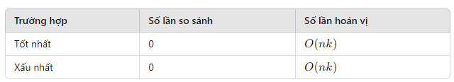

### Phân tích ưu và khuyết điểm của danh sách liên kết so với mảng một chiều. Tổng quát hóa các trường hợp nên dùng danh sách liên kết.

#### Ưu và khuyết điểm của mảng một chiều (Array)

**Ưu điểm:**
1. **Truy cập ngẫu nhiên:** Truy cập phần tử theo chỉ số với thời gian O(1). Điều này giúp thao tác lấy dữ liệu nhanh chóng và hiệu quả.
2. **Bộ nhớ liên tục:** Các phần tử được lưu trữ trong bộ nhớ liên tục, giúp tối ưu hóa về mặt hiệu năng và quản lý bộ nhớ. Điều này cũng có lợi trong việc tăng tốc độ truy cập dữ liệu do tính cục bộ bộ nhớ.
3. **Hiệu quả bộ nhớ:** Mảng không cần lưu trữ thêm thông tin như con trỏ, giúp tiết kiệm bộ nhớ so với các cấu trúc dữ liệu khác.

**Khuyết điểm:**
1. **Kích thước cố định:** Kích thước của mảng phải được xác định trước và không thể thay đổi sau khi tạo. Điều này gây khó khăn khi cần mở rộng hoặc thu hẹp kích thước mảng.
2. **Chèn/Xóa không hiệu quả:** Chèn hoặc xóa phần tử giữa mảng đòi hỏi phải dịch chuyển các phần tử khác, dẫn đến thời gian O(n). Điều này làm giảm hiệu suất khi thao tác nhiều lần chèn/xóa.
3. **Lãng phí bộ nhớ:** Nếu kích thước mảng lớn hơn số phần tử thực tế, sẽ lãng phí bộ nhớ không sử dụng.

#### Ưu và khuyết điểm của danh sách liên kết (Linked List)

**Ưu điểm:**
1. **Kích thước linh hoạt:** Danh sách liên kết có thể dễ dàng thay đổi kích thước, chèn và xóa phần tử mà không cần dịch chuyển các phần tử khác. Điều này đặc biệt hữu ích khi số lượng phần tử thay đổi liên tục.
2. **Chèn/Xóa hiệu quả:** Chèn hoặc xóa phần tử tại đầu hoặc giữa danh sách với thời gian O(1) nếu có con trỏ đến nút cần thao tác. Điều này giúp tăng hiệu suất trong các thao tác chèn/xóa.
3. **Quản lý bộ nhớ động:** Danh sách liên kết giúp tận dụng tối đa bộ nhớ động bằng cách cấp phát và giải phóng bộ nhớ khi cần, giảm thiểu lãng phí bộ nhớ.

**Khuyết điểm:**
1. **Truy cập tuần tự:** Không hỗ trợ truy cập ngẫu nhiên, phải duyệt từ đầu danh sách, thời gian truy cập phần tử là O(n). Điều này làm giảm hiệu suất khi cần truy cập trực tiếp đến phần tử.
2. **Sử dụng bộ nhớ:** Mỗi phần tử cần thêm bộ nhớ cho con trỏ (hoặc hai con trỏ trong danh sách liên kết kép), tốn bộ nhớ hơn mảng.
3. **Quản lý phức tạp:** Quản lý bộ nhớ và con trỏ phức tạp hơn, dễ xảy ra lỗi nếu không cẩn thận.

#### Tổng quát hóa các trường hợp nên dùng danh sách liên kết

1. **Dữ liệu có kích thước thay đổi thường xuyên:**
   - Khi số lượng phần tử không xác định trước và thay đổi liên tục, danh sách liên kết cho phép thêm và xóa phần tử một cách linh hoạt mà không cần định lại kích thước như mảng.

2. **Chèn và xóa phần tử thường xuyên:**
   - Khi các thao tác chèn và xóa phần tử diễn ra thường xuyên, đặc biệt ở đầu hoặc giữa danh sách, danh sách liên kết có thể thực hiện các thao tác này một cách hiệu quả hơn so với mảng.

3. **Quản lý bộ nhớ động:**
   - Khi bộ nhớ có thể bị phân mảnh và cần quản lý hiệu quả, danh sách liên kết giúp tận dụng tối đa bộ nhớ động bằng cách cấp phát và giải phóng bộ nhớ khi cần.

4. **Không cần truy cập ngẫu nhiên:**
   - Nếu không cần truy cập ngẫu nhiên đến các phần tử mà chỉ cần duyệt tuần tự, danh sách liên kết sẽ phù hợp hơn do không có lợi thế về truy cập ngẫu nhiên như mảng.

#### Ví dụ cụ thể:

- **Hàng đợi (Queue) và Ngăn xếp (Stack):**
  - Thường sử dụng danh sách liên kết để triển khai vì cần thao tác chèn và xóa ở đầu hoặc cuối danh sách một cách nhanh chóng.

- **Danh sách động:**
  - Khi cần tạo một danh sách mà kích thước thay đổi liên tục, như danh sách sinh viên đăng ký học phần trong một học kỳ.

- **Ứng dụng thao tác trên tập dữ liệu lớn:**
  - Các ứng dụng như hệ thống quản lý bộ nhớ, hệ thống tập tin (file systems) nơi việc quản lý bộ nhớ động là quan trọng.

### Tóm tắt
Danh sách liên kết và mảng một chiều có những ưu và khuyết điểm riêng. Mảng tối ưu cho truy cập ngẫu nhiên và sử dụng bộ nhớ liên tục, trong khi danh sách liên kết linh hoạt cho việc chèn, xóa và quản lý bộ nhớ động. Chọn cấu trúc dữ liệu phù hợp dựa trên yêu cầu cụ thể của bài toán và ứng dụng.

## Danh sách liên kết đơn với danh sách liên kết kép

### Danh sách liên kết đơn (Singly Linked List)

#### Ưu điểm:
- **Độ phức tạp không gian thấp:** Mỗi nút chỉ chứa một con trỏ đến nút tiếp theo.
- **Dễ cài đặt:** Cấu trúc đơn giản và dễ hiểu.
- **Chèn và xóa nhanh chóng:** Việc chèn và xóa một nút ở đầu danh sách có độ phức tạp O(1).

#### Nhược điểm:
- **Truy cập chậm:** Phải duyệt từ đầu danh sách để truy cập một phần tử, với độ phức tạp O(n).
- **Không thể duyệt ngược:** Chỉ có thể duyệt từ đầu đến cuối, không thể duyệt ngược lại.

### Danh sách liên kết kép (Doubly Linked List)

#### Ưu điểm:
- **Duyệt hai chiều:** Có thể duyệt danh sách theo cả hai chiều (từ đầu đến cuối và ngược lại).
- **Chèn và xóa linh hoạt:** Dễ dàng chèn và xóa một nút ở bất kỳ vị trí nào, với độ phức tạp O(1) nếu đã có vị trí cần chèn hoặc xóa.

#### Nhược điểm:
- **Độ phức tạp không gian cao hơn:** Mỗi nút chứa hai con trỏ, một đến nút trước và một đến nút sau, làm tăng độ phức tạp không gian.
- **Cài đặt phức tạp hơn:** Việc cài đặt và quản lý con trỏ cần nhiều công đoạn hơn.

## Cây nhị phân tìm kiếm (Binary Search Tree - BST)

### Ưu điểm:
- **Truy cập, chèn và xóa hiệu quả:** Với một cây cân bằng, các thao tác truy cập, chèn và xóa có độ phức tạp trung bình O(log n).
- **Duyệt cây theo thứ tự:** Có thể duyệt cây theo thứ tự tăng dần hoặc giảm dần một cách dễ dàng.

### Nhược điểm:
- **Cân bằng cây:** Nếu không cân bằng, cây có thể trở thành một danh sách liên kết, làm tăng độ phức tạp thao tác lên O(n).
- **Phức tạp khi cài đặt:** Cần nhiều công đoạn để duy trì tính chất cân bằng của cây.

## Cây nhị phân cân bằng (Balanced Binary Tree)

### Các loại cây nhị phân cân bằng:
1. **Cây AVL (Adelson-Velsky and Landis Tree)**
2. **Cây đỏ-đen (Red-Black Tree)**

### Cây AVL

#### Ưu điểm:
- **Cây luôn cân bằng:** Đảm bảo các thao tác truy cập, chèn và xóa có độ phức tạp O(log n).
- **Tìm kiếm nhanh:** Do luôn cân bằng nên việc tìm kiếm diễn ra nhanh chóng.

#### Nhược điểm:
- **Cân bằng tốn kém:** Việc chèn và xóa có thể yêu cầu nhiều thao tác cân bằng lại cây, tốn kém thời gian.

### Cây đỏ-đen

#### Ưu điểm:
- **Cân bằng hiệu quả:** Đảm bảo độ cao của cây không vượt quá 2*log(n+1).
- **Chèn và xóa hiệu quả:** Việc chèn và xóa ít tốn kém hơn so với cây AVL.

#### Nhược điểm:
- **Cài đặt phức tạp:** Các quy tắc về màu sắc và cấu trúc cần được quản lý chặt chẽ, làm cho việc cài đặt phức tạp hơn.

### Tổng kết
- **Danh sách liên kết đơn** thích hợp cho các ứng dụng đơn giản với yêu cầu chèn và xóa ở đầu danh sách nhanh chóng.
- **Danh sách liên kết kép** cung cấp linh hoạt hơn trong việc duyệt và thao tác với các phần tử trong danh sách.
- **Cây nhị phân tìm kiếm** cung cấp các thao tác truy cập và quản lý phần tử hiệu quả, nhưng cần đảm bảo tính cân bằng của cây.
- **Cây nhị phân cân bằng**, như cây AVL và cây đỏ-đen, cung cấp hiệu quả cao và đảm bảo cây luôn cân bằng, nhưng đi kèm với chi phí cài đặt và duy trì cao hơn.
